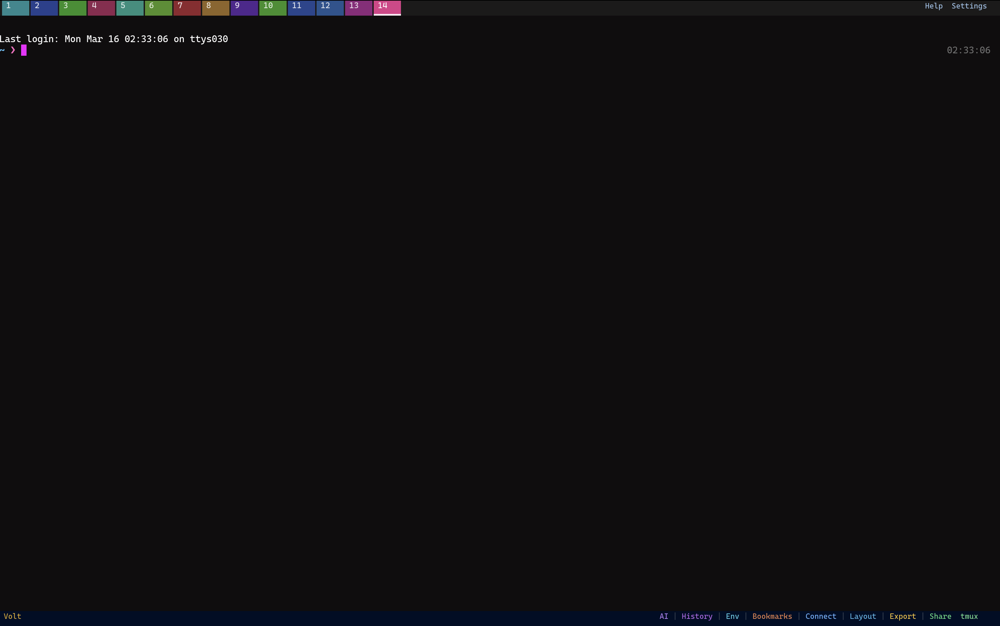
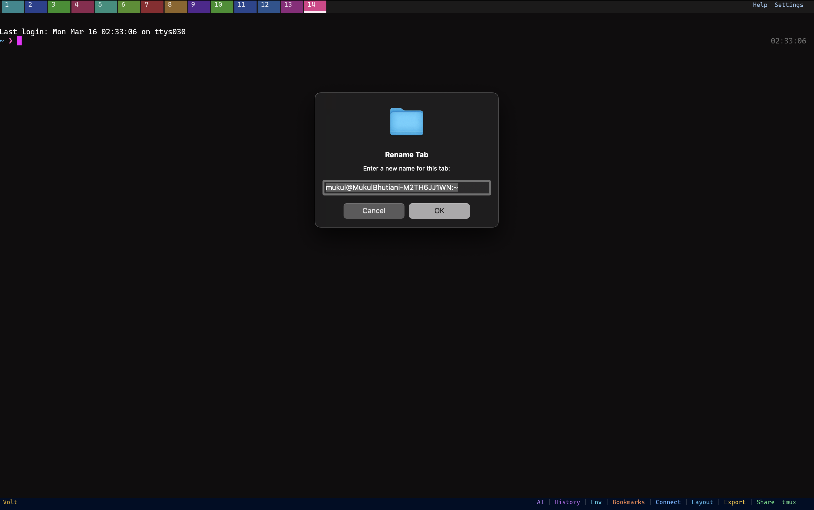
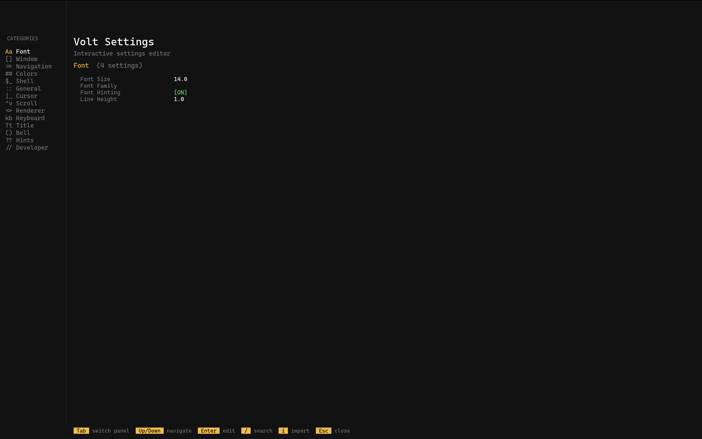
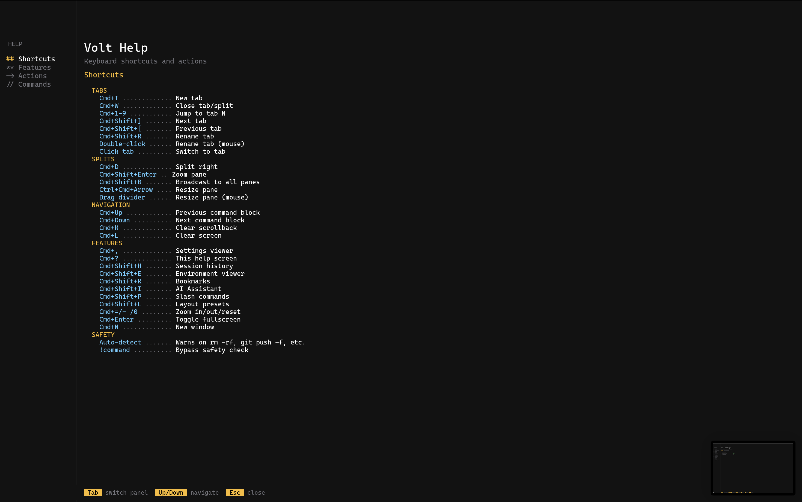
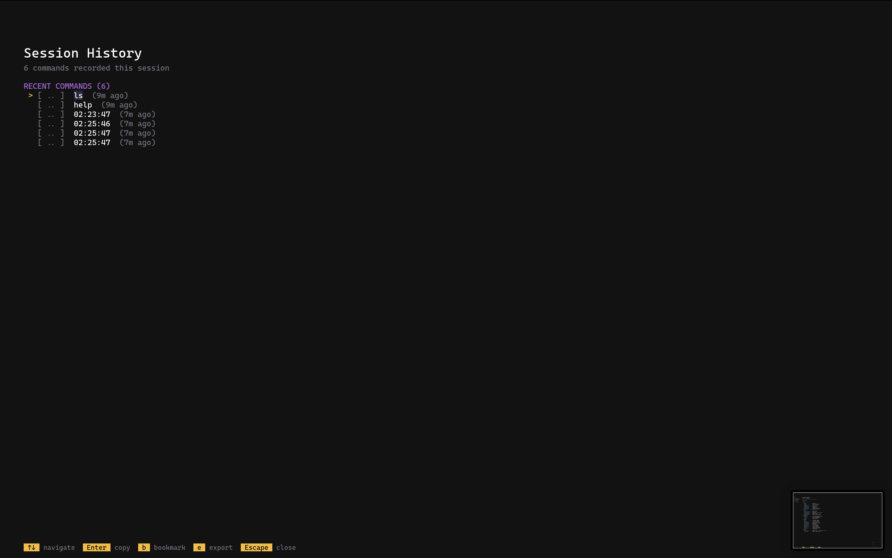
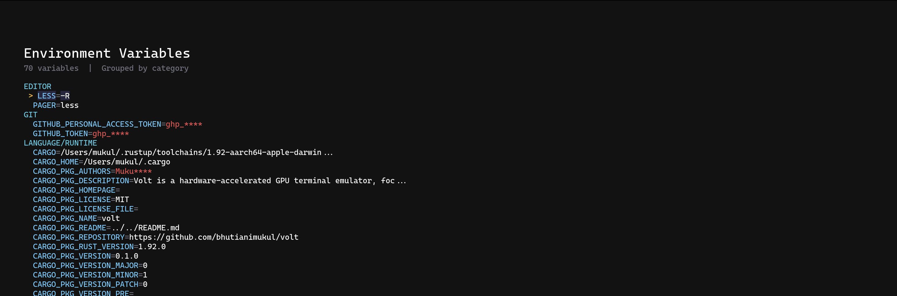
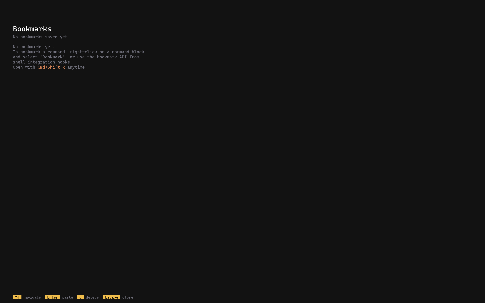
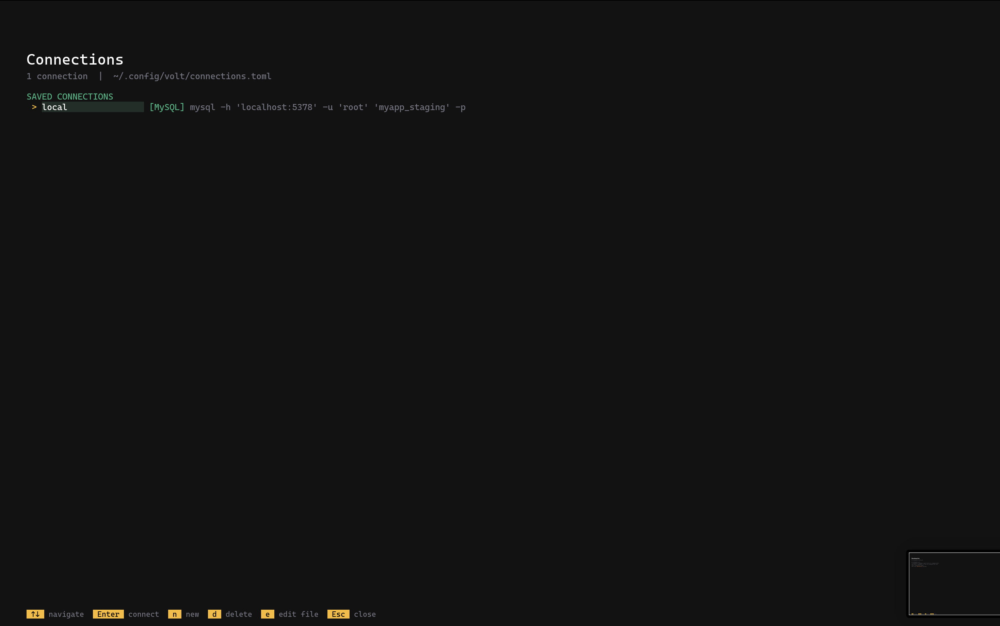
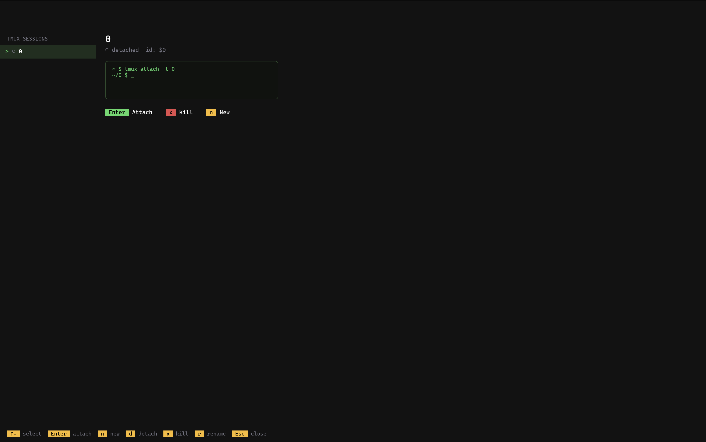
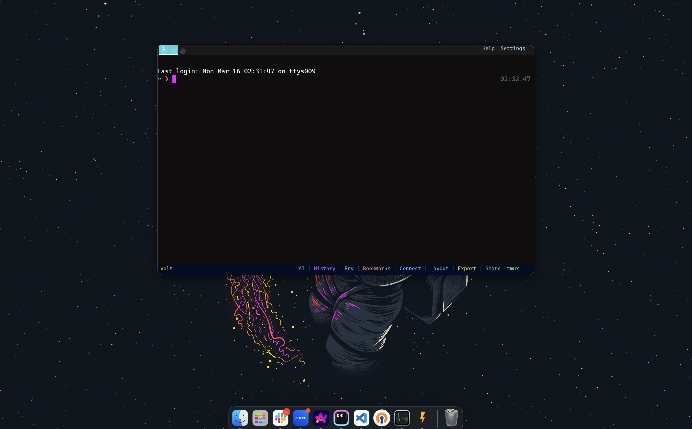

<p align="center">
  
</p>

<h1 align="center">Volt</h1>
<p align="center">A fast, modern GPU-accelerated terminal emulator built in Rust</p>

<p align="center">
  
</p>

## Highlights

- GPU-accelerated rendering (Metal/Vulkan/DX)
- 10 color-coded tabs with Cmd+1-9, double-click to rename
- Split panes with drag-to-resize dividers
- 40+ interactive settings with live preview
- Built-in AI assistant, session history, bookmarks, connections manager
- 6 layout presets, session export, tmux integration
- Colorful status bar with one-click access to all features

## Color-Coded Tabs



Each tab gets a unique color. Double-click to rename:



## Split Panes & AI Assistant


Split vertically (Cmd+D), zoom any pane (Cmd+Shift+Enter), broadcast input to all panes (Cmd+Shift+B). The AI assistant (Cmd+Shift+I) opens Claude Code in a split.

## Interactive Settings (Cmd+,)



40+ options organized by category. Navigate with arrow keys, toggle booleans with Enter, search with `/`. Import config from Alacritty, Ghostty, or Kitty with `i`.

## Help System (Cmd+?)



Four categories: Shortcuts, Features, Actions, Commands. Actions launch features directly with Enter.

## Session History (Cmd+Shift+H)



All commands recorded with exit codes, duration, and timestamps. Enter to paste, `b` to bookmark, `e` to export.

## Environment Inspector (Cmd+Shift+E)



Variables grouped by category with secrets auto-masked. Enter copies KEY=VALUE to clipboard.

## Bookmarks (Cmd+Shift+K)



Save important commands. Enter to paste, `d` to delete. Persistent across sessions.

## Connections Manager



SSH, MySQL, PostgreSQL, Redis, Kubernetes, Docker. Create with `n`, connect with Enter, edit config with `e`.

## Layout Presets (Cmd+Shift+L)


Six presets: Side by Side, Top/Bottom, Dev, Quad, Three Column, Fullscreen.

## Session Export (Cmd+Shift+X)


Export as Asciinema (.cast), Plain Text, HTML, or JSON.

## Tmux Integration (Cmd+Shift+M)



Sidebar list with session details. Attach, detach, kill, rename, create sessions.

## Session Sharing (Cmd+Shift+S)


Host or connect to shared terminal sessions over the network.

## Windowed View



## Keyboard Shortcuts

| Shortcut | Action |
|----------|--------|
| Cmd+, | Settings |
| Cmd+? | Help |
| Cmd+Shift+H | Session History |
| Cmd+Shift+E | Environment Inspector |
| Cmd+Shift+K | Bookmarks |
| Cmd+Shift+P | Slash Commands |
| Cmd+Shift+L | Layout Presets |
| Cmd+Shift+X | Session Export |
| Cmd+Shift+S | Session Sharing |
| Cmd+Shift+T | Time Travel |
| Cmd+Shift+M | Tmux Picker |
| Cmd+Shift+I | AI Assistant |
| Cmd+T | New tab |
| Cmd+W | Close tab/pane |
| Cmd+D | Split right |
| Cmd+Shift+Enter | Zoom pane |
| Cmd+Shift+B | Broadcast to all panes |
| Cmd+1-9 | Jump to tab |

## Status Bar

```
Volt                    AI | History | Env | Bookmarks | Connect | Layout | Export | Share  tmux
```

Each item is color-coded and clickable.

## Installation

```bash
git clone https://github.com/bhutianimukul/volt.git
cd volt
cargo build --release -p volt
cargo run -p volt
```

## Configuration

Config: `~/.config/volt/config.toml`

```toml
[fonts]
size = 14.0

[window]
opacity = 1.0

[window.background-image]
path = "/path/to/image.png"
opacity = 0.4

[navigation]
mode = "TopTab"
```

## Tech Stack

| Component | Technology |
|-----------|-----------|
| Language | Rust |
| GPU Rendering | WGPU (Metal/Vulkan/DX/GL) |
| Text Shaping | skrifa + font-kit |
| Config | TOML via serde |

## License

MIT
